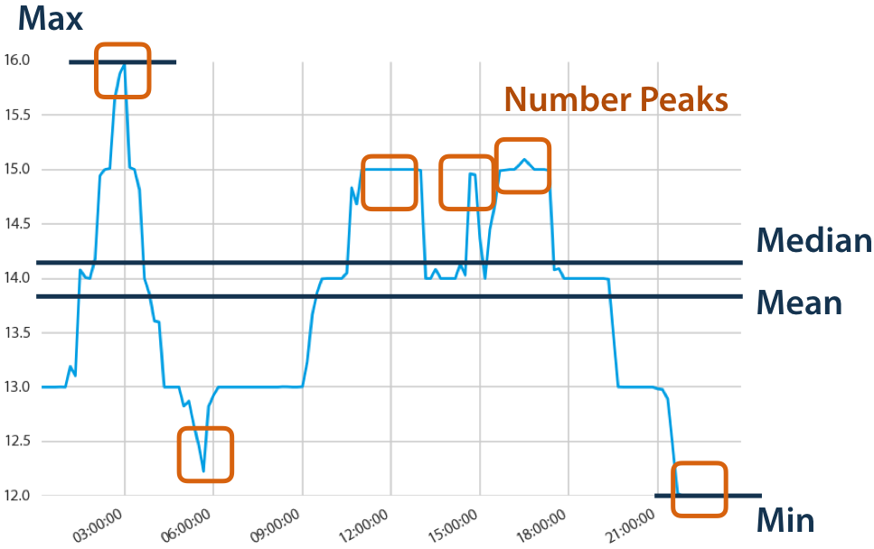
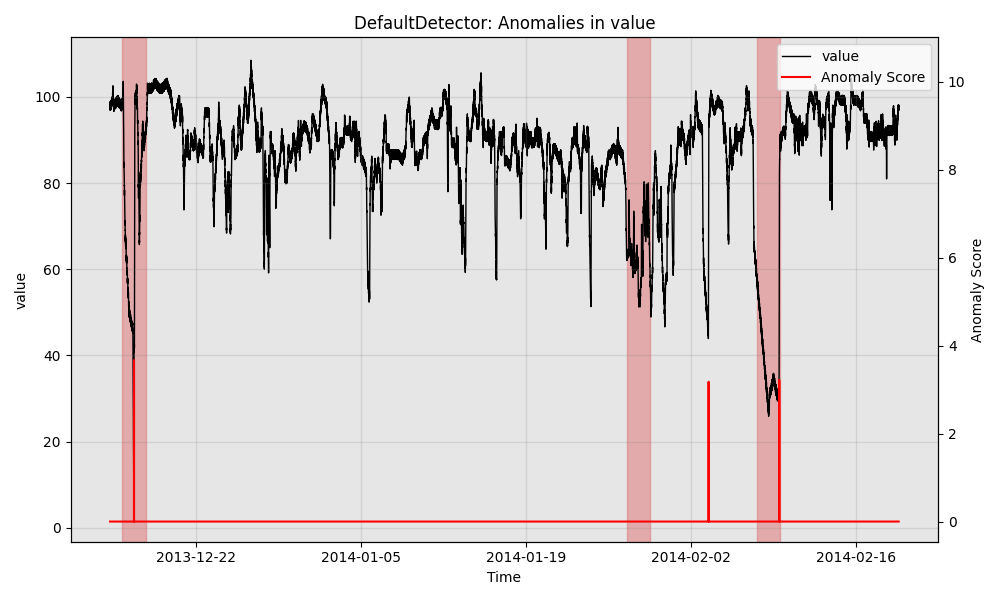

<div align="center">
<h1>TS_Combine</h1>

A time series analysis integration toolkit in Python


</div>
<hr>


## ！Notice, ts_combine integrates the following projects, you can click the link for more details.
- [darts](https://github.com/unit8co/darts)
- [Merlion](https://github.com/salesforce/Merlion)
- [prophet](https://github.com/facebook/prophet)
- [tslearn](https://github.com/tslearn-team/tslearn/)
- [tsfresh](https://github.com/blue-yonder/tsfresh)
- [sktime](https://github.com/alan-turing-institute/sktime)


| Section | Description |
|-|-|
| [Installation](#installation) | Installing the dependencies and ts_combine |
| [Getting started](#getting-started) | A quick introduction on how to use ts_combine |
| [Available features](#available-features) | An extensive overview of ts_combine's functionalities |
| [Documentation](#documentation) | A link to our API reference and a gallery of examples |
| [Contributing](#contributing) | A guide for heroes willing to contribute |
| [Acknowledgements](#acknowledgements) | Acknowledgements |
| [License](#license) | License |
## Installation
There are different alternatives to install ts_combine:

- Git: `git clone https://github.com/Chaoqun-Guo/ts_combine.git`

In order for the installation to be successful, the required dependencies must be installed. For a more detailed guide on how to install ts_combine, please see the [Documention](./docs/installation.md).

## Getting started

### 1. Getting the data in the right format
ts_combine expects a time series dataset to be formatted as a 3D `numpy` array. The 3D correspond to the number of time series, the number of measurements per time series and the number of dimensions respectively (`n_ts,max_sz,d`). In order to get the data in the right format, please see the [Documention](./docs/getting_the_data_in_the_right_format.md).

It should further be noted that tslearn included in ts_combine supports variable-length timeseries.

```
>>> from tslearn.utils import to_time_series_dataset
>>> my_first_time_series = [1, 3, 4, 2]
>>> my_second_time_series = [1, 2, 4, 2]
>>> my_third_time_series = [1, 2, 4, 2, 2]
>>> X = to_time_series_dataset([my_first_time_series,
                                my_second_time_series,
                                my_third_time_series])
>>> y = [0, 1, 1]
```

### 2. Spend less time on feature engineering
ts_combine contains the `tsfresh` python package, the package provides systematic time-series feature extraction by combining established algorithms from statistics, time-series analysis, signal processing, and nonlinear dynamics with a robust feature selection algorithm. In this context, the term time-series is interpreted in the broadest possible sense, such that any types of sampled data or even event sequences can be characterised.

Data Scientists often spend most of their time either cleaning data or building features. While we cannot change the first thing, the second can be automated. `tsfresh` frees your time spent on building features by extracting them automatically. Hence, you have more time to study the newest deep learning paper, read hacker news or build better models.

`tsfresh` automatically extracts 100s of features from time series. Those features describe basic characteristics of the time series such as the number of peaks, the average or maximal value or more complex features such as the time reversal symmetry statis

<div align="center">


</div>

### 3. Data preprocessing and transformations

Optionally, `tslearn` included in ts_combine has several utilities to preprocess the data. In order to facilitate the convergence of different algorithms, you can scale time series. Alternatively, in order to speed up training times, one can resample the data or apply a piece-wise transformation. 

```
>>> from tslearn.preprocessing import TimeSeriesScalerMinMax
>>> X_scaled = TimeSeriesScalerMinMax().fit_transform(X)
>>> print(X_scaled)
[[[0.] [0.667] [1.] [0.333] [nan]]
 [[0.] [0.333] [1.] [0.333] [nan]]
 [[0.] [0.333] [1.] [0.333] [0.333]]]
```

### 4. Training a model
After getting the data in the right format, a model can be trained. Depending on the use case, ts_combine supports different tasks: classification, clustering and regression. For an extensive overview of possibilities, check out our gallery of examples.

We begin by importing Merlion’s TimeSeries class and the data loader for the Numenta Anomaly Benchmark NAB. We can then divide a specific time series from this dataset into training and testing splits.
```
from merlion.utils import TimeSeries
from ts_datasets.anomaly import NAB

# Data loader returns pandas DataFrames, which we convert to Merlion TimeSeries
time_series, metadata = NAB(subset="realKnownCause")[3]
train_data = TimeSeries.from_pd(time_series[metadata.trainval])
test_data = TimeSeries.from_pd(time_series[~metadata.trainval])
test_labels = TimeSeries.from_pd(metadata.anomaly[~metadata.trainval])
```
We can then initialize and train Merlion’s DefaultDetector, which is an anomaly detection model that balances performance with efficiency. We also obtain its predictions on the test split.
```
from merlion.models.defaults import DefaultDetectorConfig, DefaultDetector
model = DefaultDetector(DefaultDetectorConfig())
model.train(train_data=train_data)
test_pred = model.get_anomaly_label(time_series=test_data)
```

Next, we visualize the model's predictions.
```
from merlion.plot import plot_anoms
import matplotlib.pyplot as plt
fig, ax = model.plot_anomaly(time_series=test_data)
plot_anoms(ax=ax, anomaly_labels=test_labels)
plt.show()
```
Finally, we can quantitatively evaluate the model. The precision and recall come from the fact that the model fired 3 alarms, with 2 true positives, 1 false negative, and 1 false positive. We also evaluate the mean time the model took to detect each anomaly that it correctly detected.

```
from merlion.evaluate.anomaly import TSADMetric
p = TSADMetric.Precision.value(ground_truth=test_labels, predict=test_pred)
r = TSADMetric.Recall.value(ground_truth=test_labels, predict=test_pred)
f1 = TSADMetric.F1.value(ground_truth=test_labels, predict=test_pred)
mttd = TSADMetric.MeanTimeToDetect.value(ground_truth=test_labels, predict=test_pred)
print(f"Precision: {p:.4f}, Recall: {r:.4f}, F1: {f1:.4f}\n"
      f"Mean Time To Detect: {mttd}
```
```
Precision: 0.6667, Recall: 0.6667, F1: 0.6667
Mean Time To Detect: 1 days 10:30
```
<div align="center">


</div>

## Available features

### 1. Detection and/or forecasting
The table below provides a visual overview of how Merlion's ( included in ts_combine) key features compare to other libraries for time series anomaly detection and/or forecasting.

|                     | Merlion | Prophet | Alibi Detect | Kats | statsmodels | GluonTS | RRCF | STUMPY | Greykite |pmdarima 
:---                  | :---:     | :---:|  :---:  | :---: | :---: | :---: | :---: | :---: | :----: | :---:
| Univariate Forecasting | ✅      | ✅      | | ✅    | ✅          | ✅       |      |      |✅        | ✅ 
| Multivariate Forecasting | ✅ | | | ✅ | ✅ | ✅ | | | | |
| Univariate Anomaly Detection | ✅ | ✅ | ✅ | ✅ | | | ✅ | ✅ | ✅ | ✅ | 
| Multivariate Anomaly Detection | ✅ | | ✅ | ✅ | | | ✅ | ✅ | | | |
| Change Point Detection | ✅ | ✅ | ✅ | ✅ | | | | | ✅ | |
| AutoML | ✅ | | | ✅ | | | | | ✅ | | ✅ 
| Ensembles | ✅ | | | | | | ✅  | | | | 
| Benchmarking | ✅ | | | | | ✅ | | | | | 
| Visualization | ✅ | ✅ | | ✅ | | | | | ✅ | ✅ | | 

### 2. Models
Here's a breakdown of the forecasting models currently implemented in ts_combine. We are constantly working on bringing more models and features.

Model | Univariate | Multivariate | Probabilistic | Multiple-series training | Past-observed covariates support | Future-known covariates | Static covariates support | Reference
--- | --- | --- | --- | --- | --- | --- | --- | ---
`ARIMA` | ✅ | | ✅ | | | ✅ | |
`VARIMA` | ✅ | ✅ | | | | ✅ | |
`AutoARIMA` | ✅ | | | | | ✅ | |
`StatsForecastAutoARIMA` (faster AutoARIMA) | ✅ | | ✅ | | | ✅ | | [statsforecast](https://github.com/Nixtla/statsforecast)
`ExponentialSmoothing` | ✅ | | ✅ | | | | |
`BATS` and `TBATS` | ✅ | | ✅ | | | | | [TBATS paper](https://robjhyndman.com/papers/ComplexSeasonality.pdf)
`Theta` and `FourTheta` | ✅ | | | | | | | [Theta](https://robjhyndman.com/papers/Theta.pdf) & [4 Theta](https://github.com/Mcompetitions/M4-methods/blob/master/4Theta%20method.R)
`Prophet` (see [install notes](https://github.com/unit8co/darts/blob/master/INSTALL.md#enabling-support-for-facebook-prophet)) | ✅ | | ✅ | | | ✅ | | [Prophet repo](https://github.com/facebook/prophet)
`FFT` (Fast Fourier Transform) | ✅ | | | | | | |
`KalmanForecaster` using the Kalman filter and N4SID for system identification | ✅ | ✅ | ✅ | | | ✅ | | [N4SID paper](https://people.duke.edu/~hpgavin/SystemID/References/VanOverschee-Automatica-1994.pdf)
`Croston` method | ✅ | | | | | | |
`RegressionModel`; generic wrapper around any sklearn regression model | ✅ | ✅ | | ✅ | ✅ | ✅ | |
`RandomForest` | ✅ | ✅ | | ✅ | ✅ | ✅ | |
`LinearRegressionModel` | ✅ | ✅ | ✅ | ✅ | ✅ | ✅ | |
`LightGBMModel` | ✅ | ✅ | ✅ | ✅ | ✅ | ✅ | |
`CatBoostModel` | ✅ | ✅ | ✅ | ✅ | ✅ | ✅ | |
`RNNModel` (incl. LSTM and GRU); equivalent to DeepAR in its probabilistic version | ✅ | ✅ | ✅ | ✅ | | ✅ | | [DeepAR paper](https://arxiv.org/abs/1704.04110)
`BlockRNNModel` (incl. LSTM and GRU) | ✅ | ✅ | ✅ | ✅ | ✅ | | |
`NBEATSModel` | ✅ | ✅ | ✅ | ✅ | ✅ | | | [N-BEATS paper](https://arxiv.org/abs/1905.10437)
`NHiTSModel` | ✅ | ✅ | ✅ | ✅ | ✅ | | | [N-HiTS paper](https://arxiv.org/abs/2201.12886)
`TCNModel` | ✅ | ✅ | ✅ | ✅ | ✅ | | | [TCN paper](https://arxiv.org/abs/1803.01271), [DeepTCN paper](https://arxiv.org/abs/1906.04397), [blog post](https://medium.com/unit8-machine-learning-publication/temporal-convolutional-networks-and-forecasting-5ce1b6e97ce4)
`TransformerModel` | ✅ | ✅ | ✅ | ✅ | ✅ | | |
`TFTModel` (Temporal Fusion Transformer) | ✅ | ✅ | ✅ | ✅ | ✅ | ✅ | ✅ | [TFT paper](https://arxiv.org/pdf/1912.09363.pdf), [PyTorch Forecasting](https://pytorch-forecasting.readthedocs.io/en/latest/models.html)
Naive Baselines | ✅ | | | | | | |

## Documentation
For example code and an introduction to ts_combine, see the Jupyter notebooks in examples, and the guided walkthrough here. You may find detailed API documentation (including the example code) here. The technical report outlines ts_combine's overall architecture and presents experimental results on time series anomaly detection & forecasting for both univariate and multivariate time series.

## Contributing
The development is ongoing, and we welcome suggestions, pull requests and issues on GitHub. All contributors will be acknowledged on the [change log page](./docs/change_log_page.md).

## Acknowledgements
ts_combine integrates the following projects, you can click the link for more details. [darts](https://github.com/unit8co/darts), [Merlion](https://github.com/salesforce/Merlion), [prophet](https://github.com/facebook/prophet), [tslearn](https://github.com/tslearn-team/tslearn/), [tsfresh](https://github.com/blue-yonder/tsfresh), [sktime](https://github.com/alan-turing-institute/sktime). 

Thanks for these excellent [open source projects](./repos/)
## License
ts_combine is licensed under the [MIT license](./LICENSE).
